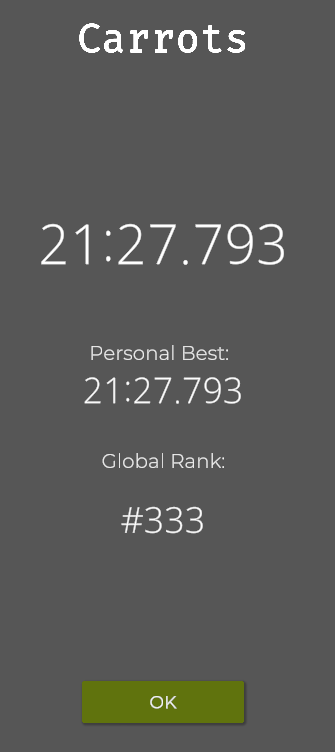

# Carrot Farming

## Prerequisites

- 32x32 World Unlocked
- 32 Drones Unlocked
- Enough Power
- Enough Water
- Enough Fertilizer

## Implementation

The idea is to spawn drones in a grid formation, get the companion of the plant, go to that location, plant the companion plant and then harvest the carrot. Ideally, you want to stock up on power, water and fertilizer to guarentee the achievement unlock, but you can still run it without those, but the rates will be lower.

## Achievements

## Leaderboards

### Carrot

Note: Using carrot_farm_polyculture.py. To make the code leaderboard applicable, change the `while True` in the drone functions to `while < 2000000000`.

### Carrot_Single

Note: Using carrot_farm_polyculture.py and deleting the code that spawns multiple drones. To make the code leaderboard applicable, change the `while True` in the drone functions to `while < 100000000`.

